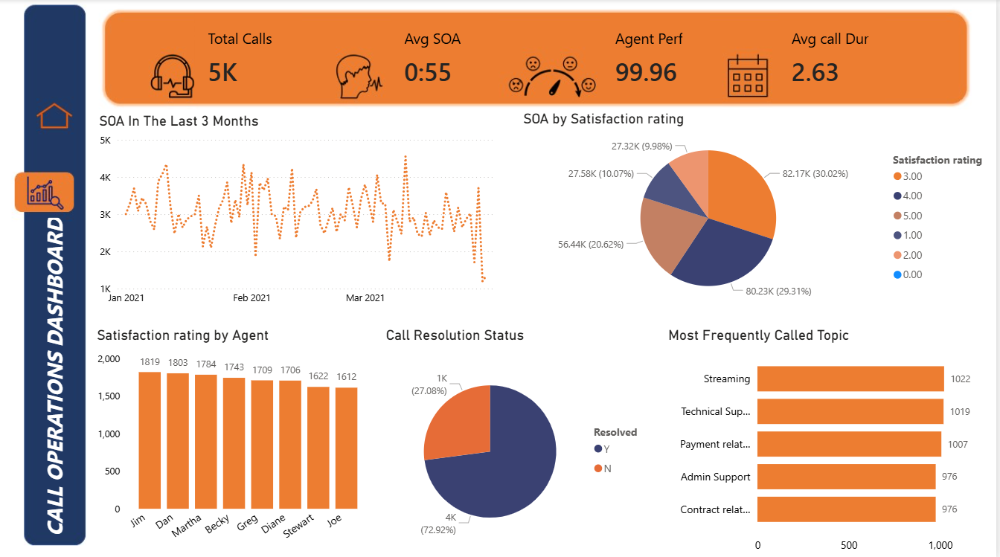

# Call Center Performance Dashboard
Evaluated call center operations to track call volume, agent performance, response times, and customer satisfaction metrics. The goal was to provide management with clear 
insights and improve service quality.

### Tools
- Microsoft Excel (data cleaning, organizing headers, preparing the dataset).
- PowerPoint (designed dashboards background and visuals).
- Power BI (DAX calculations, KPI tracking, interactive dashboard development).

### Insights
- Built an interactive Power BI dashboard with custome designed backgrounds from PowerPoint.
- Tracked KPIs and highlighted bottlenecks in agent performance and response times.
- Provide actionable recommendations to improve customer satisfaction and operational effeiciency.

### Files 
Screenshot of key visualizations.

